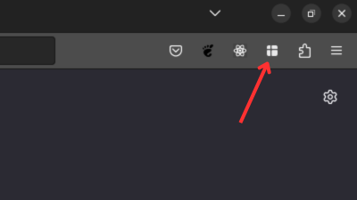
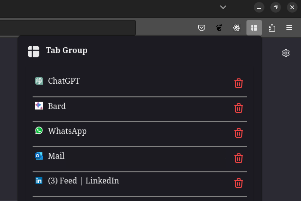

# Tab Group

DOWNLOAD URL: https://addons.mozilla.org/en-US/firefox/addon/tab_group/

Tab Group is a simple firefox extension that allows you to manage a list of priority bookmarks in your firefox browser.

Right-click on a webpage and select `Add Tab To Tab Group` to add the url to `Tab Group'

You can now pin the extension to the taskbar and easily access your important bookmarks.

